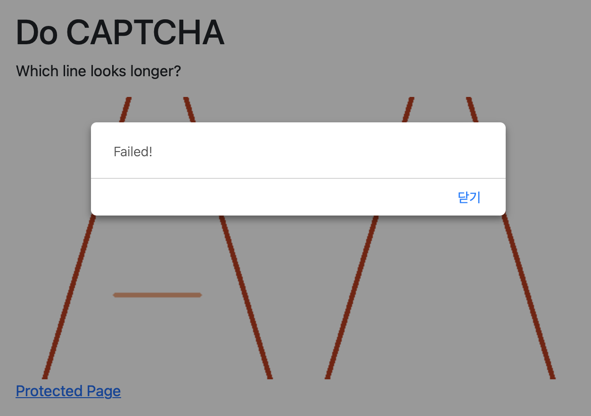

# Illusion CAPTCHA


## Overview

You must have met annoying CAPTCHAs before. In general, optical illusions arise from the complex operation of the human brain, so they can be difficult for machines to distinguish.

This project applies optical illusion to CAPTCHA in order to improve usability for humans.

## Getting Started

### Prerequisites

- Tested on Python 3.10, 3.11
- run `pip3 install -r requirements.txt` to install dependencies
- Or you can use poetry

### Run Example

- Run `run_example.sh` to start API and example server
- You can get implemented example at `http://localhost:8000`
- Or you can apply it yourself

### CAPTCHA API Server

- Set `SERVER_URL` in `api/static/illusion-captcha.js` to API server
- `uvicorn api:app --port=8001` to start server

### Frontend Page

You can implement like other CAPTCHA providers (e.g. reCAPTCHA, hCAPTCHA) by simply adding `div` with id `illusion_captcha` and load script, and install it on `div`.

```html
<div id="illusion_captcha"></div>

<script src="http://[API_SERVER]/static/illusion-captcha.js"></script>

function on_success(token) {
    location.href = "/protected?token=" + token;
}
illusion_captcha_install(300, on_success)
```

### Backend Server

You can verify client with sending request API server with token.

## Features

Illusions are generated dynamically and randomly with OpenCV.

### Multiple Shapes

|circle|rectangle|
|-|-|
|||

### Number of Images

|2|4|
|-|-|
|||

### Logic

- Index page shows random **Illusion CAPTCHA** problems
- You can't access `/protected` without solving CAPTCHA
- If clicked image is correct, then you can access protected page  
- Token is invalidated after accessing protected page

|Forbidden Page|Protected Page|Fail|
|-|-|-|
|||

## How this works

### CAPTCHA

CAPTCHA (Completely Automated Public Turing test to tell Computers and Humans Apart) is a type of security measure known as challenge-response authentication.

### Optical Illusion

Optical Illusion is an illusion caused by the visual system and characterized by a visual percept that arguably appers to differ from reality.

|Type|Image|Description|
|----|-----|-----------|
|Delboeuf||Inner circle on the right looks bigger|
|Ebbinghaus||Inner circle on the left looks bigger|
|Müller-Lyer||Line on the left looks longer|
|Ponzo||Line on the left looks longer|
|Simulaneous Contrast||Inner rectangle on the right looks darker|

## Future Enhancements

- Improve API server to use in-memory database like Redis
- Add site key, secret check logic to verify client and server
- Implement more optical illusions
- Add post processing (image filters)

## Dependencies

- [FastAPI](https://fastapi.tiangolo.com/) for api server
- [OpenCV](https://opencv.org) for generating illusion images
- [NumPy](https://numpy.org) for numerical operations

## References
- [What is CAPTCHA?](https://support.google.com/a/answer/1217728?hl=en)
- [Optical illusion](https://en.wikipedia.org/wiki/Optical_illusion)
- [hCAPTCHA](https://docs.hcaptcha.com/#basic-principles)
- [Pyllusion](https://github.com/RealityBending/Pyllusion) (PIP implementation of illusions)
